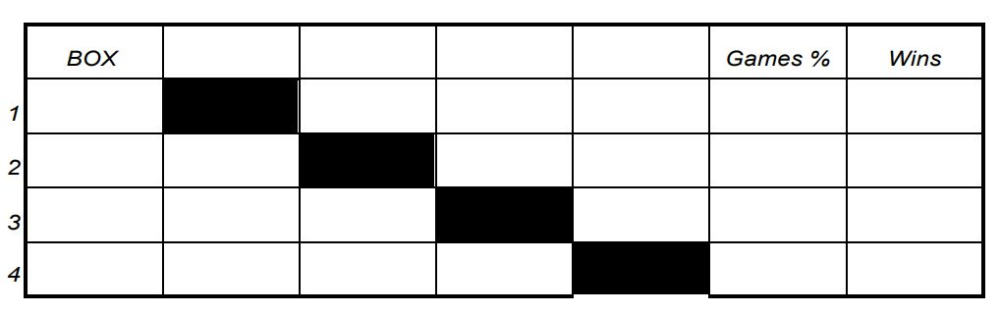

# Mogo Car Finance Ruby on Rails developer task
In this task a developer is asked to develop software that can be used to manage tournament scoring, for example, football.

### User story:
1. Home screen: There is a list of all tournaments (name, status, winner, finalist). User can create new one, by entering tournament's name.
2. New tournament: There is list of all teams, and possibility to add new team. User can choose teams to participate in this tournament. After clicking start, teams are randomly split in two divisions.
3. View Tournament: It should be possible to see each game between teams, each division separately. There should be button to generate results for all teams. When results is generated, start playoff. After playoff is started, playoff generation button should be visible. Results can also be enetered manually. Regular seasons table example:



4. User can go back to index and to any tournament anytime in the program's lifecycle.

### Functional requirements:
1. Tournament names are unique. Tournament has status (draft, in_progress, done)
2. User can enter list of teams. Together 16 teams are participating. Also there should be possibility to generate random teams. It's not allowed to add one team to a tournament multiple times.
3. Teams are split in 2 divisions – A and B – by random (8 teams in each).
4. All teams in a division play against each other. Each game between teams should be saved into database.
5. The best 4 teams from each division meet in Play-off.
6. Play-off initial schedule is made by principle 'the best team plays against the worst team'.
7. The winning team stays to play further, but the losing team is out of the game.
8. Overall winning team is the one who wins all games in play-off.
9. In order not to enter the tournament results by hand please use auto generation
10. Results must be saved in database

### Software should be developed on:
1. Ruby version 2.5.3
2. Rails 5.0 or newer.
3. Database engine MySQL 5.7.x.
4. Ruby gemset name "tournament"
5. Rspec 3.7 or higer
6. Rubocop 0.76.0 with given [rubocop.yml](./rubocop.yml) file.

### Instructions on how to submit task
1. Clone project locally
2. Code task requirements
3. Commit changes to a feature branch, and push to gitlab
4. If you have any additional instructions on how to setup you application, add it to new file INSTRUCTIONS.md
5. Send us an e-mail when task is done so we can begin checking.

*Please show your best knowledge of object-oriented programming, and Rails coding practices.*
